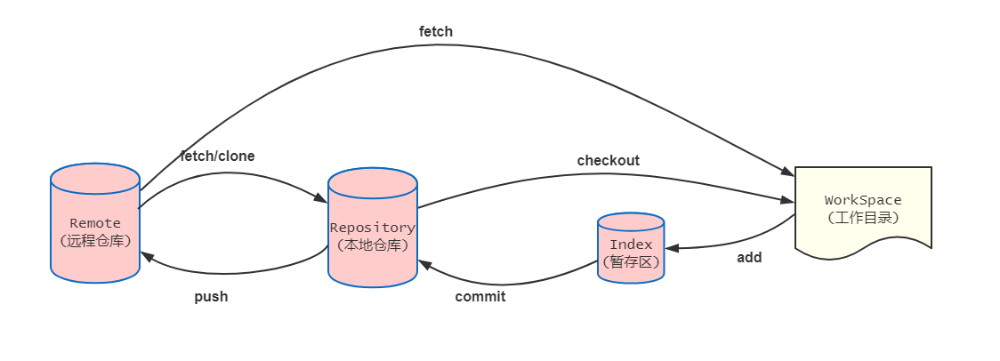
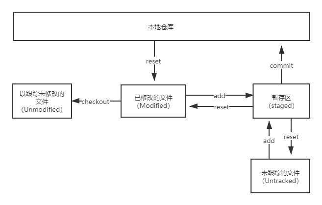

#### 一学就会的git 命令
***

#### 导读
***
使用git 已不知好几年，最近想着把常用的一些git 命令做个总结，本文主要写的是git 常用的命令。


> **阅读三连：点赞（👍）、关注（😍）、收藏（📝）。**  
> **本文 github ([一学就会的Git命令操作](https://github.com/FishStudy520/web-doc/tree/master/other/一学就会的Git命令操作.md)) 已上传，更多往期文章已分类整理。**

#### 几个常用的命令
***
```
mkdir folder_name  // 创建文件夹 [folder_name: 文件夹名称,举个栗子：git-demo]
cd  folder_name    // 进入文件夹
touch file_name    // 创建一个文件 [file_name:文件名称，举个栗子：index.js]
vim file_name      // 编辑一个文件 [举个栗子：vim index.js]
rm -rf file_name   // 删除文件或者文件夹 [rm -rf file_name]
ls       // 显示工作目录
clear    // 清除屏幕
```

#### 获取git 仓库
***
1. 第一种方式，将本地项目转换成git 仓库, 初始化创建一个名为 .git的子目录，这样你就初始化成功了；
````
mkdir git-demo //创建一个文件
cd git-demo
git init  // 创建一个名为 .git 的子目录
````
2. 第二种方式，拉取(克隆)远程已存在的git仓库；
```
git clone <url>  // url 仓库地址
git clone https://github.com/FishStudy520/git-demo.git
```

#### git config (配置用户信息) 
***
配置用户信息（用户名和邮箱）；
```
git config user.name 'your name'     // 配置用户名
git config user.email  'your email'  //配置用户邮箱
```

查看配置信息 (显示配置信息)；
```
git config --list 
```

全局配置用户只需要加 `--global`；
```
git config --global user.name 'your name'  // 全局配置用户名
```

#### git help (查看文档)
***
查看git常见的命令；
```
git help 
```

查看git 全部的命令；
```
git help -a 
```

查看git命令对应的文档, 举个栗子：
```
git help add 
```

#### git status (查看状态)
***
查看状态
```
git status 
```
主要用于查看工作区与暂存区的状态；文件状态如以下三种：  
Untracked files: 未跟踪的文件，新创建的文件 （未跟踪的文件）; 
Changes to be committed:暂存已修改的文件，该文件运行在git add 的版本历史记录中，但还没有commit   ;
Changes not staged for commit: 暂存已修改的文件;
 

1. 未跟踪的文件(Untracked)和已修改的文件（Modified）通过`git add .`提交到暂存区，使用`git reset HEAD <file>` 还原到`git add .`时的状态；
2. 已修改的文件（Modified）使用`git checkout .`将以跟踪所有已修改的文件，还原到修改前的状态（Unmodifed）；
3. 以跟踪未修改的文件（Unodified）通过本地仓库切换出新分支所得；

查看状态，简写参数：-s
```
git status -s
```

#### git add（添加到暂存区）
***
将文件/文件夹提交到暂存区，添加单个或者多个;
```
git add file file1 ...
```

将当前目录下的所有文件添加到暂存区（包含修改的文件以及新增文件）；
```
git add .
```

将已经监控的文件添加到暂存区（不包含新增的文件）；
```
git add -u
```

将当前项目下的所有变化都添加到暂存区；
```
git add -A
```


#### git commit（提交本地仓库）
***
Git commit将工作区的内容提交到本地仓库，每次提交生成一个commit-id，在版本回退起了重要的位置。

将工作区内容提交到本地仓库;
```
git commit -m 'message'
```

将暂存区已修改的文件提交到本地仓库,注：已版本控制的文件；
```
git commit -a -m 'messgae'
```

如果我们最近一次的提交信息写错了，可以使用下面命令修改；
```
git commit --amend
```

#### git 分支
***
查看本地仓库下的分支,*当前工作区分支；
```
git branch 
```

查看所有的分支（本地仓库以及远程仓库分支）；
```
git branch -a 
```

创建一个新分支；
```
git branch <branch_name>  //branch_name: 新分支名称
```

切换分支,比如你现在在master分支上，切换到develop分支；
```
git checkout develop  // 切换到develop分支
```

如果不想操作两遍，我们可以使用下面命令来创建分支，并且切换分支；
```
git checkout -b <branch_name>  // branch_name: 新分支名称
```

删除分支；
```
git branch -d  <branch_name>  // branch_name：需要删除的分支名
// 举个栗子：删除develop 分支
git branch -d develop
// 强制删除某个分支，分支未合并，如果想删除，就使用下面命令；
git branch -D develop
```
合并分支；
```
git merge <branch_name>  // branch_name: 合并的分支名
```

放弃所有已修改的文件（还原），不包含新增文件；
```
git checkout .
git checkout . file  /// 还原file文件
```

举个栗子：
```
git checkout -b testing // 创建一个testing分支，并切换到testing分支
touch index.js          // 创建一个index.js文件
// index.js，输入内容，保存
let a = 1, b=2;
git add index.js 
git commit -m 'Feat:新增 index.js文件'
git checkout master    // 切回到master 分支
git merge testing      // 合并testing分支
git branch -d testing  //删除testing分支
```

#### git checkout (检出)
***
主要的作用是切换分支或者还原工作区文件的变更。

切换分支；
```
git checkout <branch_name> // branch_name:分支名称
git checkout develop //切换到develop 分支
```
创建分支并且切换到这个分支上；
```
git checkout -b <branch_name> //  branch_name:新增分支名称
git checkout -b develop   // 创建develop 分支并切换到develop分支上
```

切换分支


#### git log(提交记录)
***
查看所有的提交记录；
```
git log   // 按 字母 q 退出查看
```
参数 
--oneline: git log 的简写，输出7个commit hash 的前7个字符，以及提交说明；
```
git log --oneline 
```

-p：查看每次提交改变的差异，这个很详细；
```
git log -p
```

--stat：查看每次提交的简略信息，可以快速查看每次提交的差异，比-p简洁；
```
git log --stat
```

--prettry：这个参数用于自定义输出格式信息；比如：oneline[单行],format[定制时间格式]
```
git log --prettry=oneline 
```

-n: n代表限制输出的数量，最近的n条提交信息；
```
git log -2  // 最近两条的提交信息
```

--graph：查看在日志旁以 ASCII 图形显示分支与合并历史；
```
git log --graph
```

#### git diff(查看差异)
***
查看当前工作区与暂存区文件修改了哪些内容（不包含新文件）；
```
git diff 
```

查看当前工作区与上一个版本的差异；
```
git diff HEAD
git diff commit-id // 与commit-id版本比较差异，commit-id：对应提交的版本号
```

查看当前工作区与另一个分支的差异；
```
git diff master  // 与master 分支比较差异
```

查看对比两个分支间的差异；
```
git diff master...develop  // 对比master分支与develop 分支的差异
```

查看哪些文件改动了，有多少，可以使用`--stat`参数；
```
git diff --stat
```

#### git tag(打标签)
***
用来标记git 版本的标记； 

查看所有的tag 标记；
```
git tag 
```
创建一个tag标记;
```
git tag v0.0.1   
```

查看某个tag的详情内容；
```
git tag <tag_name>  // tag_name: tag名称
// 比如：查看v0.0.1 标记
git tag v0.0.1
```

删除tag;
```
git tag -d v0.0.1
```

推送本地tag到远仓库；
```
git push origin --tags
```

查看远程仓库的所有tag;
```
git ls-remote --tags origin
```

以某个tag 创建新分支；
```
git checlout -b <branch_name> <tag_name>  // branch_name:新分支名，tag_name： tag名
```

#### git 推送
***
查看远程仓库；
```
git remote -v
```

添加远程仓库；
```
git remote add <short_name> <url>  // short_name: 简短的名称，url：远程仓库地址

// 举个栗子：
git remote add  fishStudy520  https://github.com/FishStudy520/git-demo.git
```

从远程仓库拉取和抓取到本地仓库，但未合并（同步远程仓库数据）；
```
git fetch <remote>    //remote： 远程地址
```

从远程仓库拉取和抓取到本地仓库，并且合并数据（同步远程仓库数据）；
```
git pull origin master  // 拉去远程仓库数据
```


推送到远程仓库；
```
git push origin master  // 推送到远程仓库的master分支
```

查看某个远程仓库；
```
git remote show origin
```

修改远程仓库名称；
```
 git remote rename old_name new_name 
 // 举个栗子：
 git remote rename fishStudy520 fish001
```

移除远程仓库；
```
git remote remove  fishStudy520  //移除远程仓库 fishStudy520
```

git pull 与 git fetch 的区别：
```
git pull = git fetch  + git merge
```


#### 贮藏与清理
***
执行贮藏操作，是将修改暂时存储到堆栈中 
场景：当你在项目上修改一些内容，而现在临时线上有个紧急bug 需要修复，但是你不想这么一会就创建一次提交，这时使用stash，将修改保存。等Bug 修改完后，再次切回原分支，从堆栈中恢复刚刚贮藏的内容。

暂存内容，添加备注信息，方便以后查找；
```
git stash save <message> // message：备注信息（可选参数下）
or
git stash //不添加备注信息
```

查看stash有哪些内容；
```
git stash list
```

显示暂存的内容修改了哪些，默认显示第一个，如果查看其他的暂存，在stash${num}，num代表哪个暂存；
```
git show stash      //默认第一个，索引为0，
git show stash@{1}  // 查看第二次暂存的内容有哪些
```

应用某个暂存，但不会在堆栈列表中删除，这里的索引从0开始；注：0最新的一次暂存，1上一次暂存，以此类推；
```
git stash apply // 默认使用最近一次的暂存，相当于 git stash apply stash${0} 
git stash apply stash${1}  // 使用第二个暂存
```

应用某个暂存，并且从堆栈列表中删除；
```
git stash pop stash@{2}  // 使用第3个暂存,并且删除从缓存中删除
```

使用完之后，将之前的某次暂存从列表中删除；
```
git stash drop stash@{2}  // 丢弃列表中的第3次暂存
```

删除所有贮藏的stash；
```
git stash clear
```

#### 最后
***
如果喜欢或对你有用，那就点个赞呗（👍👍👍）！ (╯ε╰)(╯ε╰)(╯ε╰)。  
